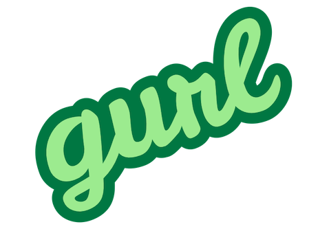

# Development

## Build

```bash
go build -o build/gurl cmd/gurl/main.go
```

### Building libxml2 on macos:

```
# Download last version of libxml2
tar xvzf libxml2-2.9.9.tar.gz
cd libxml2-2.9.9
./configure --prefix=/opt/local
make
make install
```
### Building zlib on macos:

<http://zlib.net>

```
tar xvzf zlib-1.2.11.tar
cd zlib-1.2.11
./configure --prefix=/opt/local
make
make install
```

### Building libiconv macos:

<https://www.gnu.org/software/libiconv/>

<https://ftp.gnu.org/pub/gnu/libiconv/libiconv-1.16.tar.gz>

```
tar xvzf libiconv-1.16.tar
cd libiconv-1.16
./configure --enable-static --prefix=/opt/local
make
make install
```

### Building XZ Utils (liblzma)

<https://tukaani.org/xz/>

```
tar xvzf xz-5.2.4.tar
cd xz-5.2.4
./configure --prefix=/opt/local
make
make install
```

### Dynamic library dependencies

```
# macos
otool -L <binary>

```


## Test 

```
go test ./...
```

## Misc

```bash
# Build:
tools/build.sh

# Unit tests:
tools/test.sh

# Unit test and coverage report:
tools/coverage.sh

# Line count:
tools/cloc.sh
# Only Go:
tools/cloc.sh | grep Go | tr -s ' ' | cut -d ' ' -f 5
```

<https://jeanchristophamiel.pages.gitlab.si.francetelecom.fr/coverage.html>

# Usage

## Basic

```bash
./gurl ~/Documents/Dev/reunion/integration/hurl/generated/jdd-26-rue-des-bancouliers.hurl
```

## HTML or terminal formatter

```bash
# HTML with syntax coloring
./gurl -p html ~/Documents/Dev/reunion/integration/hurl/generated/jdd-26-rue-des-bancouliers.hurl > /tmp/x.html && open -a "Safari" /tmp/x.html

# Terminal with syntax coloring (whitespaces not visible)
./gurl -p term snippet.hurl

# Terminal with syntax coloring (whitespaces visible)
./gurl -p termws snippet.hurl

# Hurl ast exported to json
./gurl -p json snippet.hurl | jq
```

# Dev links

<https://unix.stackexchange.com/questions/105568/how-can-i-list-the-available-color-names>
